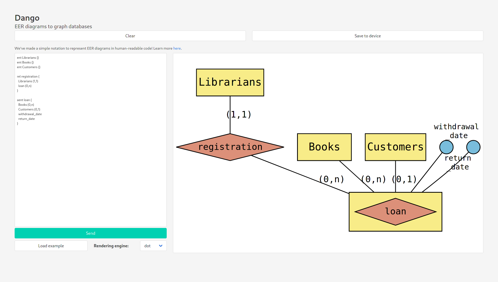

# Dango 

EER model to Neo4j schema

## About

**Dango** is a graph database modeling tool which allows you to write a schema for a Neo4j database by writing an Enhanced Entity-Relationship diagram.

The schema generated is composed of [Neo4j constraints](https://neo4j.com/docs/cypher-manual/current/administration/constraints/) and [APOC triggers](https://neo4j.com/docs/labs/apoc/current/background-operations/triggers/), which force the nodes and relationships in the database to behave as modeled.

**Screenshot:**

## Installing

__Note #1:__ *You'll need at least __Node.js version 11__ to run this application, **version 15** is recommended.*

__Note #2:__ *You'll need a [Neo4j](https://neo4j.com/) instance running with [APOC](https://neo4j.com/labs/apoc/) installed and `apoc.trigger.enabled=true` to be able to add the triggers to your database instance.*

* Clone this repository: `git clone https://github.com/telmotrooper/dango.git`
* Install the dependencies: `npm install`
* To run the application, use: `npm start`
